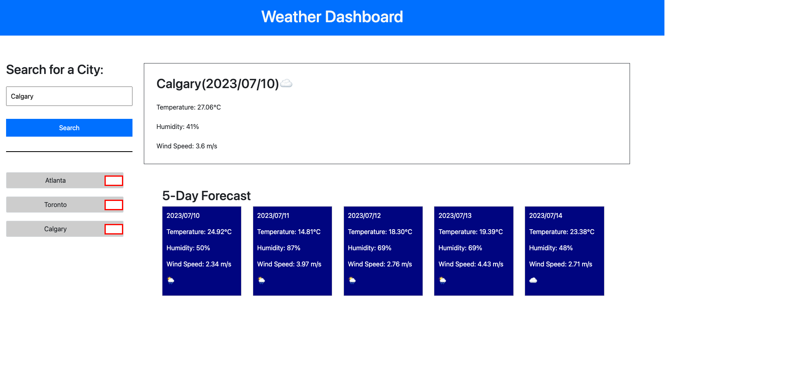

# Creating a Weather Dashboard Using 3rd Party API

## Description

The weather forms a normal part of our daily lifestyle. It helps to make decision on our timing to perform certain activities, fashion and how to go about our activities. Making weather applications easily acessible is very important. Fortunately, there are thrid party APIs that one can incoporate into their applications. That is what this project is about.

The github repository can be found at https://github.com/StanOp09/Weather_Dashboard

The live website is hosted at https://stanop09.github.io/Weather_Dashboard/

The following user story and acceptance criteria was addopted from https://git.bootcampcontent.com/University-of-Toronto/UTOR-VIRT-FSF-PT-05-2023-U-LOLC/-/tree/main/06-Server-Side-APIs/02-Challenge

## User Story

```
AS A traveler
I WANT to see the weather outlook for multiple cities
SO THAT I can plan a trip accordingly
```

## Acceptance Criteria

```
GIVEN a weather dashboard with form inputs
WHEN I search for a city
THEN I am presented with current and future conditions for that city and that city is added to the search history
WHEN I view current weather conditions for that city
THEN I am presented with the city name, the date, an icon representation of weather conditions, the temperature, the humidity, and the wind speed
WHEN I view future weather conditions for that city
THEN I am presented with a 5-day forecast that displays the date, an icon representation of weather conditions, the temperature, the wind speed, and the humidity
WHEN I click on a city in the search history
THEN I am again presented with current and future conditions for that city
```

## Appearance and Functionality


## Credits
Sean Roshan

ChatGPT

https://getbootstrap.com

https://day.js.org/en/

https://jqueryui.com

https://openweathermap.org/forecast5